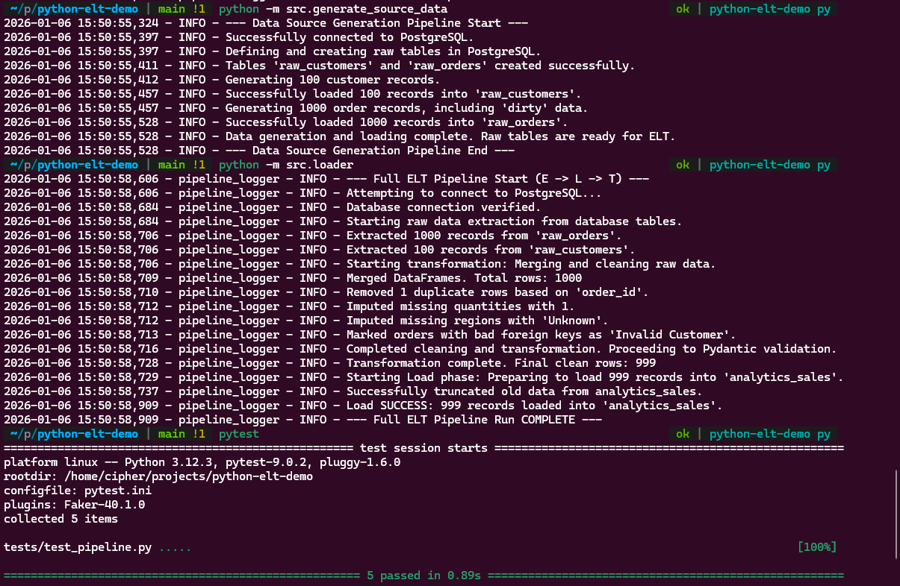

# Python ELT Demo (Learning Project)

This repository is a learning and demonstration project that shows how a simple ELT / ETL-style analytics pipeline can be built using plain Python, without relying on heavy data engineering frameworks.

**Note:** This project is not production-ready and is intended for educational purposes only.

The main goals of this project are to:
- Teach data analysts and beginners how ELT/ETL pipelines work
- Demonstrate data extraction, cleaning, validation, and transformation
- Show how analytics-ready tables can be built using **Python**, **Pandas**, and **SQL**
- Provide a simple, reproducible pipeline to experiment with

---



---

## What This Project Demonstrates

- Extracting data from a relational database
- Working with messy, imperfect source data
- Cleaning, deduplicating, and transforming data
- Schema validation using **Pydantic**
- Simple feature engineering for analytics
- Loading clean data into an analytics table
- Writing tests for data pipelines using **pytest**
- Using **Docker** for a reproducible local database

All logic is written in plain Python, intentionally avoiding complex frameworks.

---

## Project Structure

```bash
python-elt-demo/
├── src/
│   ├── loader.py                  # Loads cleaned data back into the database
│   ├── cleaner.py                 # Cleans and transforms data
│   ├── extractor.py               # Extracts raw data from PostgreSQL
│   ├── schemas.py                 # Data validation schemas (Pydantic)
│   └── generate_source_data.py    # Generates fake, messy source data               
├── tests/
│   ├── test_cleaner.py       # Tests transformation logic
│   └── test_pipeline.py      # End-to-end pipeline tests
├── docker-compose.yml        # Local PostgreSQL setup
├── requirements.txt
└── README.md
```
---

## Usage

### **1. Clone the Repository**
```bash
git clone https://github.com/shahidmalik4/python-elt-demo.git
cd python-elt-demo
```

### **2. Install Requirements**
```bash
pip install -r requirements.txt
```

### **3. Start the Database**
```bash
docker compose up -d
```

### **4. Generate Source Data**
```bash
python -m src.generate_source_data
```
**Note**:
- This project uses a src/ layout.
- Always run commands from the project root directory.


### **5. Run the Full Pipeline**
```bash
python -m src.loader
```
**This will:**
- Extract raw data
- Clean and validate it
- Load an analytics-ready table

### **6. Run Tests**
```bash
pytest
```
Tests focus on data correctness, not performance.

---

## Feel free to fork it, break it, and experiment 🚀


